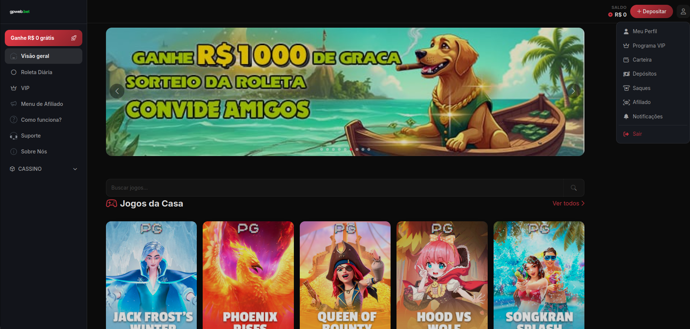

<p align="center">
  
</p>

<h1 align="center">🎰 MarioBET - iGaming Platform</h1>

<p align="center">
  Plataforma completa de cassino online com jogos exclusivos, sistema de depósitos via PIX, programa de afiliados, níveis VIP e roleta diária.
</p>

<p align="center">
  
  
  
  
  
  
  
</p>

---

## ✨ Funcionalidades

### 🎮 Jogos Exclusivos
12 jogos originais com motor próprio de slots e RNG customizado:

- Fortune Tiger, Fortune Rabbit, Fortune Mouse, Fortune Ox, Fortune Panda
- Bikini Paradise, Hood vs Wolf, Jack Frost, Phoenix Rises
- Queen of Bounty, Songkran Party, Treasures of Aztec

**Recursos dos jogos:** streaks de vitórias/derrotas, modo influenciador, freespins, compra de bônus, modo demo.

### 💰 Sistema Financeiro
- Depósitos via PIX com QR Code (Efí Pay)
- Saques via PIX 
- Histórico de transações completo
- Bônus de primeiro depósito configurável
- Bônus de saldo

### 👑 Programa VIP
- Níveis VIP com progressão baseada em depósitos e apostas
- Bônus semanais (disponível às segundas)
- Bônus mensais (disponível dia 1º)
- Recompensas de upagem de nível
- Indicador visual de progresso

### 🤝 Programa de Afiliados
- Modelo **Revshare** (% do GGR)
- Modelo **CPA** (comissão fixa por depositante)
- Código de afiliado único (`MB` + 8 caracteres)
- Dashboard com métricas e comissões
- Exportação CSV
- Solicitação de saque de comissões

### 🎡 Roleta Diária
- Recompensas diárias por spin
- Recompensas customizáveis com probabilidades ponderadas
- Slots "garantidos"
- Um spin por dia por usuário

### ⚙️ Painel Administrativo (Filament)
- Gestão de usuários, carteiras, jogos, provedores
- Gerenciamento de banners e configurações da plataforma
- Aprovação/rejeição de saques
- Registros de pagamentos PIX
- Níveis VIP e bônus
- Recompensas da roleta
- Dashboard com estatísticas e gráficos de receita
- Ranking de afiliados

### 🔐 Autenticação
- Cadastro/login com email e senha (rate limit: 3 tentativas/60min)
- Login social (Google, Facebook, Twitter/X, LinkedIn)
- Recuperação de senha
- Código de afiliado no registro
- CPF único obrigatório (validação com dígitos verificadores)
- Bloqueio de conta

---

## 🛠️ Tecnologias

| Tecnologia | Versão | Finalidade |
|------------|--------|------------|
| **Laravel** | 12.x | Framework backend |
| **PHP** | 8.3+ | Linguagem |
| **Filament** | 5.x | Painel administrativo |
| **Tailwind CSS** | 4.x | Framework CSS |
| **Alpine.js** | 3.14 | Interatividade frontend |
| **Vite** | 6.x | Build tool |
| **MySQL** | - | Banco de dados |
| **Redis** | - | Cache, fila, sessão |
| **Laravel Sanctum** | 4.x | API tokens |
| **Laravel Socialite** | 5.15 | Login social |
| **Spatie Permission** | 6.x | Papéis e permissões |
| **Efí Pay** | - | Gateway de pagamento PIX |
| **Pest PHP** | 3.x | Testes |

---

## 📋 Pré-requisitos

- PHP 8.3+
- Composer 2.x
- Node.js 20+
- MySQL 8+ ou MariaDB
- Redis (recomendado)
- Certificado SSL para produção

---

## 🚀 Instalação

```bash
# Clone o repositório
git clone https://github.com/seu-usuario/mariobet.git
cd mariobet

# Instale as dependências PHP
composer install

# Instale as dependências frontend
npm install

# Copie o arquivo de ambiente
cp .env.example .env

# Configure o banco de dados no .env
DB_DATABASE=mariobet
DB_USERNAME=root
DB_PASSWORD=

# Configure a gateway Efí no .env
EFI_CLIENT_ID=seu_client_id
EFI_CLIENT_SECRET=seu_client_secret
EFI_CHAVE_PIX=sua_chave_pix
EFI_CERT_PATH=/caminho/cert.pem
EFI_KEY_PATH=/caminho/key.pem
EFI_CERT_PASSWORD=sua_senha

# Gere a chave da aplicação
php artisan key:generate

# Execute as migrações e seeders
php artisan migrate --seed

# Crie o link simbólico para storage
php artisan storage:link

# Compile os assets
npm run build

# Inicie o servidor
php artisan serve
```

---

## ⚙️ Configuração

### Gateway de Pagamento (Efí Pay)
1. Crie uma conta em [Efí Pay](https://www.efi.com.br)
2. Gere as credenciais (Client ID, Client Secret)
3. Faça upload do certificado (cert.pem, key.pem)
4. Configure as variáveis no `.env`
5. Configure o webhook: `https://seudominio.com/webhook/pix`

### Painel Administrativo
Acesse `/admin` após criar um usuário com papel de administrador:

```bash
php artisan tinker
> $user = User::find(1);
> $user->assignRole('admin');
```

### Estrutura de Papéis
- **admin** — Acesso total ao painel
- **influencer** — Algoritmos especiais nos jogos (modo demonstração)
- **user** — Acesso padrão (atribuído automaticamente no registro)

---

## 🏗️ Estrutura do Projeto

```
app/
├── Http/
│   ├── Controllers/
│   │   ├── Auth/        # Autenticação e login social
│   │   ├── Gateway/     # Integração Efí Pay
│   │   ├── Games/       # 12 controladores de jogos
│   │   ├── Panel/       # Painel do usuário
│   │   ├── Web/         # Páginas públicas
│   │   └── Api/         # API de provedores
│   └── Middleware/
├── Models/              # 19 modelos Eloquent
├── Traits/
│   ├── Gateways/        # EfíTrait (PIX completo)
│   ├── Affiliates/      # Comissões de afiliados
│   └── Providers/       # Motor de jogos privados
├── Services/            # AffiliateService, UserService
├── Filament/            # Recursos e widgets do admin
├── Helpers/             # Core.php (helpers diversos)
└── Notifications/       # Notificações admin

database/
├── migrations/          # 38 migrações
└── seeders/             # Dados iniciais

resources/
└── views/
    ├── auth/            # Login, registro, senha
    ├── panel/           # Carteira, perfil, afiliados, VIP
    ├── web/             # Home, jogos, provedores, roleta
    ├── includes/        # Navbar, footer, depósito, banner
    └── layouts/         # Layout principal

routes/
├── web/                 # Rotas públicas e do painel
├── groups/provider/     # Rotas do gateway Efí
└── api/                 # API de provedores de jogos
```

---

## 📦 Pacotes Principais

### Produção
| Pacote | Versão |
|--------|--------|
| `laravel/framework` | ^12.0 |
| `filament/filament` | ^5.0 |
| `spatie/laravel-permission` | ^6.0 |
| `laravel/sanctum` | ^4.0 |
| `laravel/socialite` | ^5.15 |
| `guzzlehttp/guzzle` | ^7.9 |

### Desenvolvimento
| Pacote | Versão |
|--------|--------|
| `pestphp/pest` | ^3.0 |
| `laravel/sail` | ^1.36 |
| `laravel/pint` | ^1.18 |
| `fakerphp/faker` | ^1.23 |

### Frontend
| Pacote | Versão |
|--------|--------|
| `alpinejs` | ^3.14 |
| `tailwindcss` | ^4.0 |
| `vite` | ^6.0 |

---

## 🧪 Testes

```bash
php artisan test
```

---

## 🌐 Rotas Principais

| Rota | Descrição |
|------|-----------|
| `/` | Home page |
| `/painel/carteira` | Carteira do usuário |
| `/painel/depositar` | Depósito via PIX |
| `/painel/sacar` | Solicitar saque |
| `/painel/vip` | Painel VIP |
| `/painel/afiliados` | Dashboard de afiliados |
| `/painel/perfil` | Editar perfil |
| `/admin` | Painel administrativo |
| `/jogar/{slug}` | Página do jogo |
| `/roleta` | Roleta diária |
| `/como-funciona` | Como funciona |
| `/suporte` | Suporte |
| `/sobre-nos` | Sobre nós |

---

## 📄 Licença

Proprietária. Consulte o proprietário do projeto para termos de uso.
